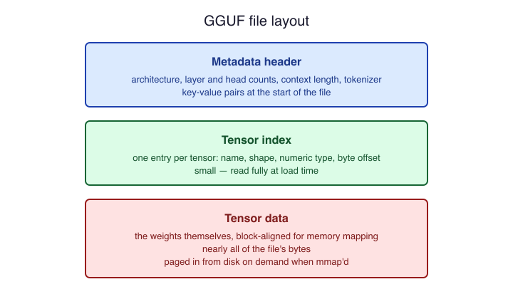

# What a Model File Actually Is

## A file full of numbers

A chat model on disk is, almost entirely, a large collection of
floating-point numbers called weights. Each weight is one parameter of
the model, and a "7B" model carries about seven billion of them. The
weights are grouped into tensors: named, multi-dimensional arrays with a
declared shape. One tensor might be the embedding table that turns a
token id into a vector; another might be one projection matrix inside
one attention layer. Nothing else about the model is mysterious — the
architecture (how many layers, how the tensors are wired together) is
fixed by the program that loads the file, and the file's job is to hand
over the numbers plus enough metadata to interpret them.

## The GGUF layout

GGUF is the single-file format used by llama.cpp and most home-inference
tools. It was designed so that one file, downloaded once, contains
everything needed to run the model. From the start of the file to the
end, a GGUF holds three regions:

- A metadata header of key-value pairs: the architecture name, layer
  count, attention head counts, embedding width, context length the
  model was trained for, and the quantization scheme of each tensor.
- The tokenizer: the vocabulary, merge rules, and the chat template, so
  the file can turn text into token ids and back without any sidecar
  files.
- A tensor index recording each tensor's name, shape, numeric type, and
  byte offset, followed by the tensor data itself, aligned so the
  operating system can map it directly.

## Why the layout matters at home

The tensor index and alignment exist for one reason: memory mapping. A
loader can `mmap` the file instead of reading it, which means the
operating system pages weight data in from disk only when computation
touches it. A model that would take minutes to `read()` into RAM starts
producing tokens in seconds, and memory the run never touches is never
paged in at all. This is why the same file works on a laptop with 16 GB
of RAM and on a GPU box: the format never forces you to hold the whole
model in memory at once, even though you can.

## What the file does not contain

A GGUF carries no code and no runtime. The same file runs on CPU, CUDA,
Metal, or Vulkan because the math lives in the loader, not the file. It
also carries no guarantee about speed: the file only tells you how many
bytes the weights occupy. Whether those bytes sit in VRAM, RAM, or swap
— and how fast the hardware can stream them — is a decision you make at
load time, and it is the subject of the rest of this module.
