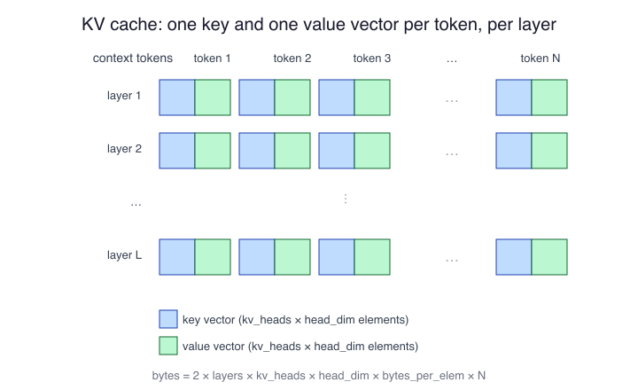

# The KV Cache

## Why attention needs a memory

A language model generates one token at a time, and every new token
attends to every token that came before it. The attention mechanism
does this with two vectors per token per layer: a key vector, which
says what the token offers to later tokens, and a value vector, which
says what the token contributes when attended to. Recomputing those
vectors for the whole conversation on every step would redo the same
work thousands of times, so the runtime stores them instead. That store
is the KV cache: one key vector and one value vector, for every token
in the context, in every layer.

## The size formula

The cache is a plain array and its size follows directly from what it
holds:

```text
kv_bytes = 2 × layers × kv_heads × head_dim × bytes_per_elem × context_tokens
```

Each factor is one degree of freedom in the array:

- 2: one key tensor and one value tensor.
- layers: the cache exists in every transformer layer.
- kv_heads: key/value heads per layer. With grouped-query attention
  (GQA) this is smaller than the number of query heads — often 4 or 8
  where queries have 32 — and it is the kv_heads figure, not the query
  count, that sizes the cache.
- head_dim: the width of each head's vectors, commonly 64 or 128.
- bytes_per_elem: 2 for the usual FP16 cache.
- context_tokens: every token currently in the context, prompt included.

```text
kv_bytes_per_token = 2 × layers × kv_heads × head_dim × bytes_per_elem
total_kv           = kv_bytes_per_token × context_tokens
```

## A worked example

Take a model with 32 layers, 8 KV heads of width 128, and an FP16
cache:

```text
kv_bytes_per_token = 2 × 32 × 8 × 128 × 2
                   = 131,072 bytes
                   = 128 KiB per token

at 2,048 tokens:  128 KiB × 2,048  = 256 MiB
at 8,192 tokens:  128 KiB × 8,192  = 1 GiB
at 32,768 tokens: 128 KiB × 32,768 = 4 GiB
```



## What the formula buys you

Three consequences follow straight from the arithmetic. First, the
cache grows linearly with context length and with nothing else you
control at runtime — doubling the context doubles the cache, while the
weights do not move. Second, the cache belongs to the conversation, not
the model: two simultaneous chats on one model carry two full caches.
Third, GQA is a memory feature as much as a speed feature — a model
with 8 KV heads needs a quarter of the cache of an otherwise identical
model with 32, which is why modern architectures adopted it. When a
long-context session blows the memory budget on hardware that ran short
sessions fine, the KV cache is where the bytes went.
