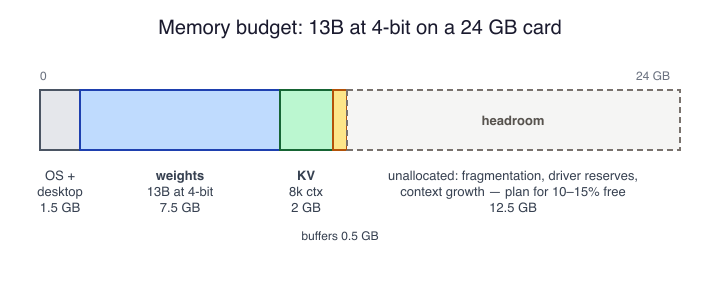

# Memory Fit SAQ

Self-check questions for the module on how models fit in memory. Answer
each from memory first, then compare against the suggested responses.

## Self-Assessment Questions

1. \* Name the three regions of a GGUF file, in the order they appear.
2. \* A 7B model stored with 16-bit weights: roughly how much memory do
   the weights occupy, and what rule produces that figure?
3. \*\* The diagram shows a memory budget for a 13B model at 4-bit on a
   24 GB card.
   
   List the four terms that make up the budget, and explain why the
   plan should not allocate the entire card.
4. \*\* Write the formula for KV-cache size in bytes and identify what
   each factor means.
5. \*\* Explain why doubling the context length doubles the KV cache
   but leaves the weight memory unchanged.
6. \*\*\* A 34B model at 4-bit (about 20 GB of weights) is loaded with
   memory mapping on a machine with 16 GB of RAM. It produces text, but
   chat gets slower the longer it runs. Explain the mechanism, then
   rank the available remedies from most to least effective.

## Suggested Response - Q1

Response:

- A metadata header of key-value pairs: architecture, layer and head
  counts, context length, and the embedded tokenizer.
- A tensor index recording each tensor's name, shape, numeric type,
  and byte offset.
- The tensor data itself: the model's weights, aligned so the file can
  be memory-mapped.

## Suggested Response - Q2

**Response:**

About 14 GB. The rule is memory for weights ≈ parameter count × bytes
per parameter: 7 billion parameters × 2 bytes per 16-bit weight = 14 GB
(plus a few percent for metadata).

## Suggested Response - Q3

response:

- Weights: the model file's size, about 7.5 GB for a 13B at 4-bit.
- KV cache: computed from layers, KV heads, head width, element size,
  and the context length actually used — about 2 GB at 8,192 tokens.
- Compute buffers for the activations of tokens in flight, typically a
  few hundred megabytes.
- Memory already in use by the OS, desktop, and other applications.

The plan should leave roughly 10–15% of the card free because
allocators fragment, drivers reserve unreported regions, and a context
that grows past plan has nowhere to go; a budget balanced at 99% fails
in practice.

## Suggested Response - Q4

Response:

```text
kv_bytes = 2 × layers × kv_heads × head_dim × bytes_per_elem × context_tokens
```

- 2: one key tensor and one value tensor per token.
- layers: the cache exists in every transformer layer.
- kv_heads: key/value heads per layer; with grouped-query attention
  this is smaller than the query head count, and it is the kv_heads
  figure that sizes the cache.
- head_dim: the width of each head's key and value vectors.
- bytes_per_elem: the cache's element size, 2 bytes for FP16.
- context_tokens: every token currently in the context, prompt
  included.

## Suggested Response - Q5

Response:

The KV cache stores one key vector and one value vector per token in
every layer, so its size is proportional to the number of tokens in the
context: doubling the context doubles the number of stored vectors.

The weights are fixed learned parameters. They are read once per
generated token no matter how long the context is, so their memory is a
constant that depends only on the model and its quantization, not on
how much text is in the conversation.

## Suggested Response - Q6

Response:

The working set — weights plus KV cache plus buffers — is larger than
physical RAM, so the operating system evicts mapped pages to make room.
Inference re-reads essentially every weight for every token, so evicted
pages are faulted back in from disk continuously, and as the KV cache
grows with the conversation the pressure worsens and the token rate
sags toward the drive's read speed.

Remedies, most to least effective:

- Use a smaller model or a smaller quantization so the working set
  fits in RAM.
- Shorten the context to shrink the KV cache's share of the pressure.
- Add RAM if the machine allows it.
- Rely on swap: not a remedy, since every token then stalls on disk
  I/O and throughput collapses.
